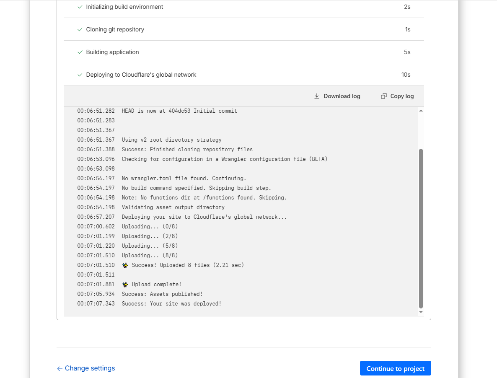
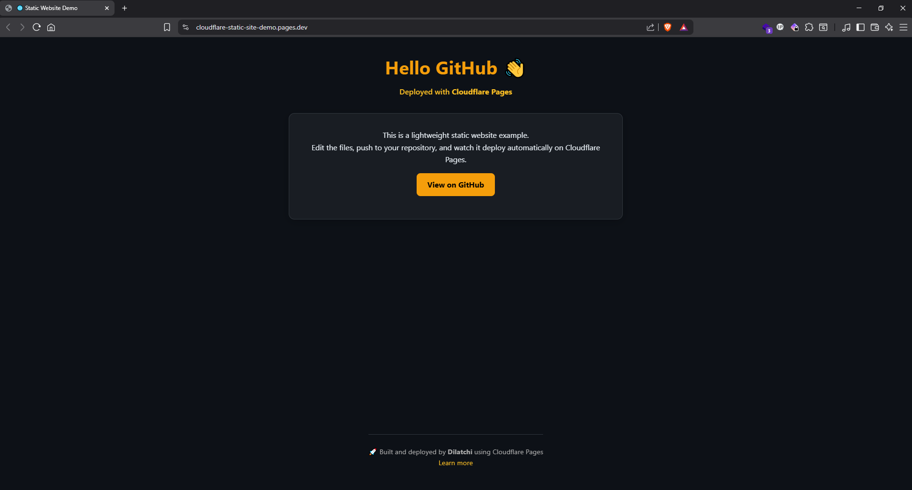

# 🌐 Cloudflare Pages — Static Website Tutorial
[]()
[](https://pages.cloudflare.com)
[](LICENSE)
[]()

---

## 🧭 Overview

This repository is a **step-by-step tutorial** and starter template to help you **create, host, and deploy** a static website using **GitHub** and **Cloudflare Pages**.

It is designed for learning — each step includes a clear instruction and a placeholder for a screenshot so learners can follow visually.

---

## 🧱 Project structure

```
/
├── index.html
├── style.css
├── README.md
└── screenshots/
    ├── 01-github-repo.png
    ├── 02-cloudflare-create-project.png
    ├── 03-select-repo.png
    ├── 04-build-settings.png
    ├── 05-deploy.png
    └── 06-live-site.png
```

## 🎯 Goals

By following this tutorial you will learn how to:

- Host your website source on **GitHub**  
- Connect GitHub to **Cloudflare Pages** for automated builds  
- Configure build/output settings for a static site  
- Use Cloudflare DNS and enable HTTPS (custom domain or `.pages.dev`)  

---

## 🧩 Quick start

### 1️⃣ Create or fork the repository

- Fork this repo (or create a new repo and copy files).
- Clone it locally:

```bash
git clone https://github.com/dilatchi/cloudflare-static-site-demo.git
cd cloudflare-static-site-demo
```

**Screenshot (GitHub repo created / forked):**


*Example: repository with `index.html`, `style.css`, and `screenshots/` folder.*

---

### 2️⃣ Edit your site files

Modify `index.html` and `style.css` to build your page.


Commit your changes:

```bash
git add .
git commit -m "Customize site content"
git push origin main
```

**Screenshot (local edits / files committed):**


*I used GitHub Desktop to commit and push.*

---

### 3️⃣ Create a Cloudflare Pages project

1. Go to: https://pages.cloudflare.com  
2. Click **Create a project**  
3. Connect your **GitHub** account (authorize Cloudflare to read repos)  
4. Select the repository you just pushed

**Screenshot (Cloudflare — create project):**


*Cloudflare integration / choose repository.*

---

### 4️⃣ Configure build settings

- **Branch:** `main` (or whichever branch you use)  
- **Build command:** *(leave empty for plain HTML)*  
- **Output directory:** `/` (root)

If you use a static site generator (Hugo, Gatsby, etc.), set the appropriate build command and output folder.

**Screenshot (Build settings):**


*Where to put build command and output directory.*

---

### 5️⃣ Deploy

- Click **Save and Deploy** (or **Start deployment**)  
- Cloudflare Pages will trigger a build and publish to a `.pages.dev` URL

**Screenshot (Deployment in progress / success):**


*Deployment logs or success page.*

---

### 6️⃣ View live site & configure custom domain

- Your live URL will look like: `https://<project-name>.pages.dev`  
- To use a custom domain:  
  - In Cloudflare Pages, add a custom domain  
  - Configure DNS records (Cloudflare usually does this automatically if your domain is on Cloudflare)  
  - SSL is provisioned automatically

**Screenshot (Live site):**


*Example of the site served via Cloudflare Pages.*

---

## ✅ Troubleshooting & tips

- **Blank page after deploy?** Check the output directory and build logs in Cloudflare Pages.  
- **Custom domain not issuing SSL?** Ensure DNS is managed by Cloudflare (nameservers set to Cloudflare) or follow their domain verification steps.  
- **Want redirects / headers?** Use Cloudflare Workers or `_headers` / `_redirects` if supported by your framework.  
- **Private repo?** Cloudflare Pages supports connecting private repos; authorize access during setup.

---

## 🧾 Licensing & attribution

This tutorial is provided as-is for learning and educational use.

- License: **MIT** — see `LICENSE` file.

---

## 📬 Contact & credits
  
Architecting simple and powerful solutions for the cloud ☁️

- GitHub: `https://github.com/dilatchi`  
- Email: `dilatchi@pm.me`

---
